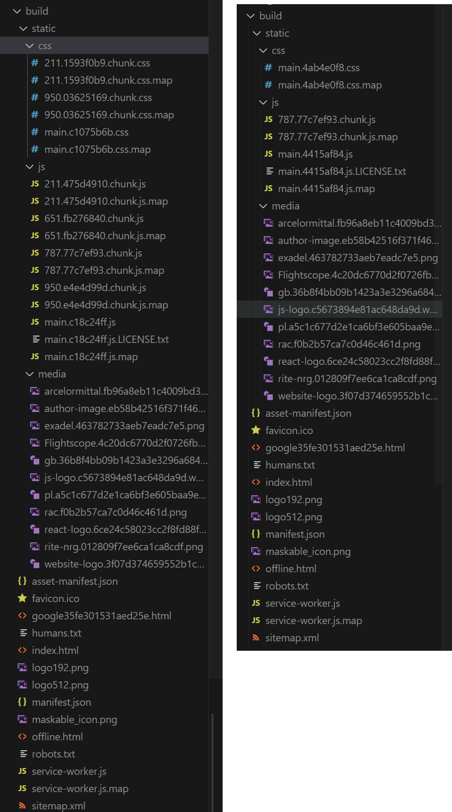

# weback-playground

Repository to try out webpack.

Followed resources on [webpack docs](https://webpack.js.org/concepts).

To start this repo's project I have used simple tutorial on [Webpack for Static Sites](https://medium.com/riow/webpack-for-static-sites-9cbfd8363abb).

## Babel

Babel can be used in building with Webpack.

In order to empploy Babel, there are couple of scenarios:

-   install `npm i babel-polyfill -D` and add `import 'babel-polyfill'` to main file (entry point), this way we will get many pollyfills (at time of writing, bundle grew from 4.5K chars to 100K chars, so 20x bigger),

-   to support older borwsers, `babel-loader` could be used, in order to do that, we need to `npm install -D babel-loader @babel/core @babel/preset-env`, and then include it correctly in `webpack.config.js`.

### Replacing arrow function for greater support

Webpack uses arrow functions when produces the bundle, but it can be prevented by setting `output.environment.arrowFunction = false` in `webpack.config.js` file. But it only instructs webpack how to create the bundle (output). It does not take care of code we wrote, so it won't transpile (change) arrow functions written by us.

In order to also prevent that, we need to set `targets` option for `babel-loader` to browser not supporting arrow functions, for example Chrome, version below 44. So we have such configuration for `babel-loader`:

```JS
{
    test: /\.(?:js|mjs|cjs)$/,
    exclude: /node_modules/,
    use: {
        loader: 'babel-loader',
        options: {
            presets: [
                ['@babel/preset-env', { targets: { chrome: 40 } }],
                // ['@babel/preset-env', { targets: 'defaults' }],
            ],
        },
    },
},
```

## Bundling CSS

Firstly, I have used `css-loader` and `style-laoder`. The `style-ladoer` library was used to inject ouptput of `css-loader` into JS (as `style` element).

**`webpack.config.js`**:

```
{
    test: /\.css$/,
    use: ['style-loader', 'css-loader'],
},
```

There is also another way, we can switch `style-loader` to `mini-css-extract-plugin` to have separate CSS files as output.

**`webpack.config.js`**

```
{
    test: /\.css$/,
    use: [MiniCssExtractPlugin.loader, 'css-loader'],
},
```

Also plugins need to be updated:

```
plugins: [
    ...
    new MiniCssExtractPlugin(),
],
```

## Multi page applicaitons

[Multi-Page Application Webpack docs.](https://webpack.js.org/concepts/entry-points/#multi-page-application)

We can speicify multiple entry points, such as

```
module.exports = {
  entry: {
    index: './src/index.js',
    otherPage: './src/otherPage.js'
  },
};
```

In order to complete configuration, to prevent multiple outputs writing to the same file (which results in webpack's error), we need also to define:

```
output: {
    ...
    filename: 'bundle[name].js',
    ...
},
```

Later, we can also specify which HTML files will be bundled with what JS bundles by specifying `chunks` matching `entry` entries:

```
new HtmlWebpackPlugin({
    filename: 'index.html',
    template: 'src/index.html',
    chunks: ['index'],
}),
new HtmlWebpackPlugin({
    filename: 'otherPage.html',
    template: 'src/otherPage.html',
    chunks: ['otherPage'],
}),
```

## Code splitting

In order to have more performant initial load, we may reduce general bundle and split it into chunks that will load later. Best example is use of React's `lazy` function:

```
const MyComponent = lazy(() => import('MyComponent'))
```

It makes that code for the component is loaded in the client's browser once needed, not in initial bundle. It has its reflection in how bundles are created - when using code splitting (with React's `lazy` for example), bundles are split into multiple files that are lazily loaded. Left picture presents code-splitted build, picture on the right does not use this optimization:

